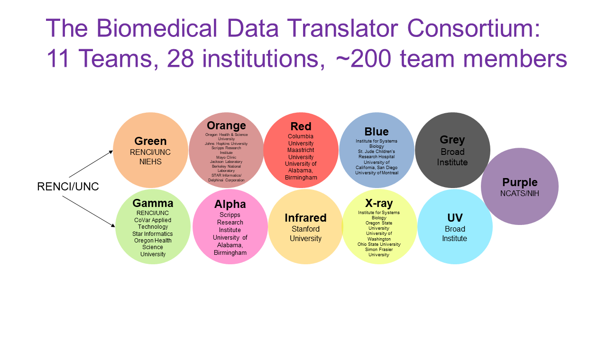

The National Center for Advancing Translational Sciences (NCATS) launched the Biomedical Data Translator ("Translator") program in October 2016 in an effort to overcome challenges in application of the myriad biomedical datasets that are available today for the greater public good. Those challenges include the compartmentalization of data across diseases and disciplines, disparate data types, a lack of semantic harmonization within and across datasets, an inability to discover and access datasets, insufficient documentation on datasets and the tools to use them, and numerous other challenges that hinder the use of "big data." These challenges are not unique to the biomedical field, but rather impact numerous fields, including business, finance, education, political science, social science, and others.

The Translator program aims to provide a comprehensive, open solution to accelerate clinical and translational research and drive innovations in clinical care and drug discovery. Specifically, the program aims "to bridge the current symptom-based diagnosis of disease with research-based molecular and cellular characterizations through an informatics platform that enables interrogation of relationships across the full spectrum of data types, from disease names, clinical signs and symptoms, to organ and cell pathology, genomics, and drug effects" (Austin et al. 2019; _The Biomedical Data Translator Consortium 2019_a;b). While still in the feasibility phase, the Translator ‘system’ or platform of modular, interchangeable tools and services has demonstrated remarkable early success, as revealed by use cases that span the clinical and translational spectrum. Example use cases, and a description of the Translator services and tools used to generate them, are provided within this site. We focus on Translator capabilities and applications in which [RENCI](https://renci.org/) played a key role.

**Funding Support:** OT3TR002026 [Blue], OT3TR002020 [Green], OT3TR002025 [Grey], OT3TR002019 [Orange], OT3TR002027 [Red], OT2TR002517 [Alpha], OT2TR002514 [Gamma], OT2TR002515 [IR], OT2TR002584 [UV], OT2TR002520 [X-Ray], UL1TR002489 [NC TraCS]

**References:**

Austin CP, Colvis CM, Southall NT. Deconstructing the translational tower of babel. *Clin Transl Sci* 2019;12(2):85. [doi:10.1111/cts.12595](https://doi.org/10.1111/cts.12595). https://www.ncbi.nlm.nih.gov/pubmed/30412342.

The Biomedical Data Translator Consortium. The Biomedical Data Translator program: conception, culture, and community. *Clin Transl Sci* 2019;12(2):86–90. [doi:10.1111/cts.12592](https://doi.org/10.1111/cts.12592). https://www.ncbi.nlm.nih.gov/pubmed/30412340. [**K Fecho**, lead author; **SC Ahalt**, **DB Peden**, **A Tropsha**, key contributors]

The Biomedical Data Translator Consortium. Toward a universal biomedical data translator. *Clin Transl Sci* 2019;12(2):91–94. [doi:10.1111/cts.12591](https://doi.org/10.1111/cts.12591). https://www.ncbi.nlm.nih.gov/pubmed/304121337. [**K. Fecho**, lead author; **SC Ahalt**, senior author; **J Balhoff**, **C Bizon**, **S Cox**, **DB Peden**, key contributors]
