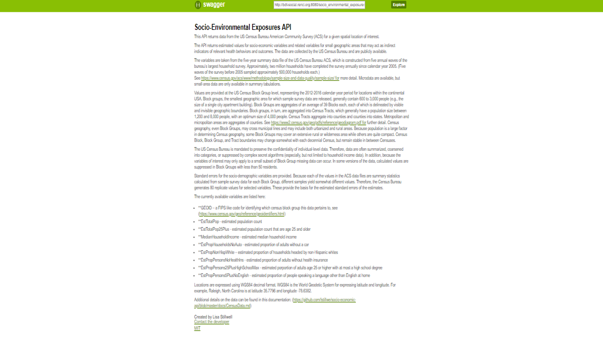
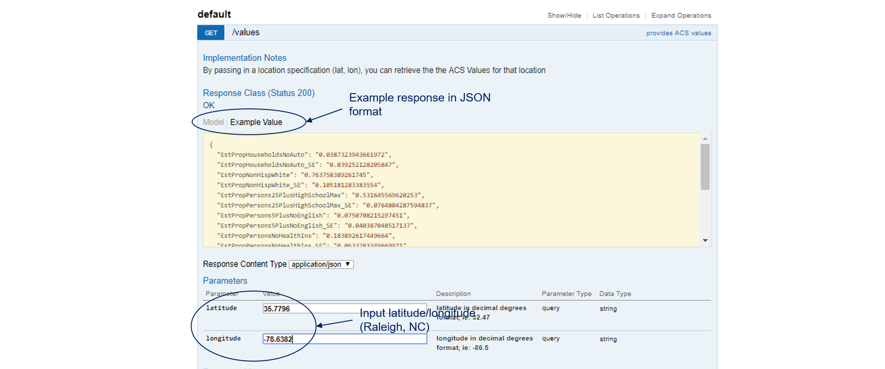

## Overview

[**Socio-environmental Exposures API**](http://bdt-social.renci.org:8080/socio_environmental_exposures_api/v1/ui/#!/default/get_values)

This API returns data from the US Census Bureau American Community Survey (ACS) for a given spatial location of interest.

The API returns estimated values for socio-economic variables and related variables for small geographic areas that may act as indirect indicators of relevant health behaviors and outcomes. The data are collected by the US Census Bureau and are publicly available.

The variables are taken from the five-year summary data file of the US Census Bureau ACS, which is constructed from five annual waves of the bureau’s largest household survey. Approximately, two million households have completed the survey annually since calendar year 2005. (Five waves of the survey before 2005 sampled approximately 500,000 households each.) See https://www.census.gov/acs/www/methodology/sample-size-and-data-quality/sample-size/ for more detail. Microdata are available, but small-area data are only available in summary tabulations.

Values are provided at the US Census Block Group level, representing the 2012-2016 calendar-year period for locations within the continental USA. Block groups, the smallest geographic area for which sample survey data are released, generally contain 600 to 3,000 people (e.g., the size of a single city apartment building). Block Groups are aggregates of an average of 39 Blocks each, each of which is delineated by visible and invisible geographic boundaries. Block groups, in turn, are aggregated into Census Tracts, which generally have a population size between 1,200 and 8,000 people, with an optimum size of 4,000 people. Census Tracts aggregate into counties and counties into states. Metropolitan and micropolitan areas are aggregates of counties. See https://www2.census.gov/geo/pdfs/reference/geodiagram.pdf for further detail. Census geography, even Block Groups, may cross municipal lines and may include both urbanized and rural areas. Because population is a large factor in determining Census geography, some Block Groups may cover an extensive rural or wilderness area while others are quite compact. Census Block, Block Group, and Tract boundaries may change somewhat with each decennial Census, but remain stable in between Censuses.

The US Census Bureau is mandated to preserve the confidentiality of individual-level data. Therefore, data are often summarized, coarsened into categories, or suppressed by complex secret algorithms (especially, but not limited to household income data). In addition, because the variables of interest may only apply to a small subset of Block Group missing data can occur. In some versions of the data, calculated values are suppressed in Block Groups with less than 50 residents.

Standard errors for the socio-demographic variables are provided. Because each of the values in the ACS data files are summary statistics calculated from sample survey data for each Block Group, different samples yield somewhat different values. Therefore, the Census Bureau generates 80 replicate values for selected variables. These provide the basis for the estimated standard errors of the estimates.

The currently available variables are listed here:

- GEOID – a FIPS like code for identifying which census block group this data pertains to, see (https://www.census.gov/geo/reference/geoidentifiers.html)
- EstTotalPop - estimated population count
- EstTotalPop25Plus - estimated population count that are age 25 and older
- MedianHouseholdIncome - estimated median household income
- EstPropHouseholdsNoAuto - estimated proportion of adults without a car
- EstPropNonHispWhite – estimated proportion of households headed by non-Hispanic whites
- EstPropPersonsNoHealthIns - estimated proportion of adults without health insurance
- EstPropPersons25PlusHighSchoolMax - estimated porportion of adults age 25 or higher with at most a high school degree
- EstPropPersons5PlusNoEnglish - estimated proportion of people speaking a language other than English at home

## User Manual

The screenshot below provides a textual overview of the Socio-environmental Exposures API.

This screenshot provides default settings and example API outpt in JSON format.

