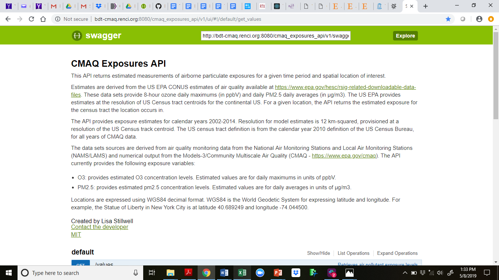
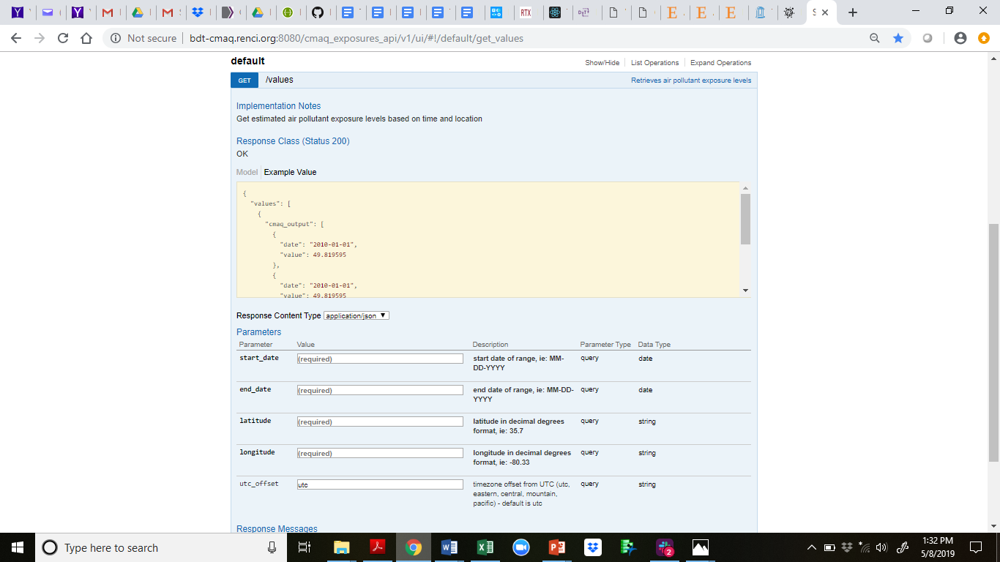

URL: http://bdt-cmaq.renci.org:8080/cmaq_exposures_api/v1/ui/#!/default/get_values

This API returns estimated measurements of airborne particulate exposures for a given time period and spatial location of interest.

Estimates are derived from the US EPA CONUS estimates of air quality available at https://www.epa.gov/hesc/rsig-related-downloadable-data-files. These data sets provide 8-hour ozone daily maximums (in ppbV) and daily PM2.5 daily averages (in µg/m3). The US EPA provides estimates at the resolution of US Census tract centroids for the continental US. For a given location, the API returns the estimated exposure for the census tract the location occurs in.

The API provides exposure estimates for calendar years 2002-2014. Resolution for model estimates is 12 km-squared, provisioned at a resolution of the US Census track centroid. The US census tract definition is from the calendar year 2010 definition of the US Census Bureau, for all years of CMAQ data.

The data sets sources are derived from air quality monitoring data from the National Air Monitoring Stations and Local Air Monitoring Stations (NAMS/LAMS) and numerical output from the Models-3/Community Multiscale Air Quality (CMAQ - https://www.epa.gov/cmaq).

The API currently provides the following exposure variables:

- O3: provides estimated O3 concentration levels. Estimated values are for daily maximums in units of ppbV.
- PM2.5: provides estimated pm2.5 concentration levels. Estimated values are for daily averages in units of µg/m3.

Locations are expressed using WGS84 decimal format. WGS84 is the World Geodetic System for expressing latitude and longitude. For example, the Statue of Liberty in New York City is at latitude 40.689249 and longitude -74.044500.

