## ICEES (Integrated Clinical and Environmental Exposures Service)

## Overview
Access to clinical data is critical for the advancement of translational research. Yet, the many regulations that surround the use of clinical data, while critical to ensure and respect patient privacy, often hinder access to clinical data for research purposes. Moreover, the ability to share clinical data across institutions is central to open team science and the success of multi-institutional consortia such as The Biomedical Data Translator Consortium. One of the goals of the Translator program is to find novel ways to openly share computable data, including sensitive clinical data, and allow its integration in surprising ways (Ahalt et al. 2019).

For example, [RENCI](https://renci.org/) and colleagues at the North Carolina Translational and Clinical Sciences Institute developed a novel approach for openly exposing clinical data on patients from UNC Health Care: the Integrated Clinical and Environmental Exposures Service (ICEES). ICEES provides open, regulatory-compliant access to clinical data that have been integrated with environmental exposures data (Fecho et al. 2019). The exposures data are derived from public sources, including data on: airborne pollutants from the US EPA Community Multiscale Air Quality Modeling (CAMQ) system; roadway exposures from the US DOT Highway Patrol Monitoring System and the US Census Bureau TIGER line system; socio-environmental exposures from the US Census Bureau American Community Survey; and public school exposures from the National Center for Education Statistics. A custom, geospatial- and time-based, data-conversion and -integration pipeline has been developed to support the creation of ‘ICEES integrated feature tables’ (Pfaff et al. 2019, Xu et al. 2020). The pipeline is modular and extensible and can be adapted for virtually any type of data that is of interest to researchers and requires geocodes, dates, and/or identifiers for integration.

Note that the exposures data are accessible independent of ICEES via open APIs: [US EPA CMAQ Airborne Exposures API](https://bdt-cmaq.renci.org/cmaq_exposures_api/v1/ui/); [US DOT Roadway Exposures API](https://bdt-proximity.renci.org/roadway_proximity_api/v1/ui/); and [US Census Bureau ACS API](https://bdt-social.renci.org/socio_environmental_exposures_api/v1/ui/). Each of these APIs/services contains documentation on their content and user access, including inputs and outputs. The data can be applied to numerous use cases. For example, the Exposures APIs have been used by investigators at NIEHS for integrations with survey data as part of their Personalized Environment and Genes Study (PEGS) (formerly the Environmental Polymorphisms Registry) (Valencia et al. 2020).

## User Manual

**ICEES Overview**

ICEES provides a regulatory-compliant, open framework and approach for sharing sensitive patient data, with minimal risk of data leakage and multiple embedded safeguards. ICEES exposes sufficiently granular clinical data to support reasoning and inference. It is compliant with HIPAA and UNC Chapel Hill policies and was approved by the Oversight Committee of the Carolina Data Warehouse for Health.

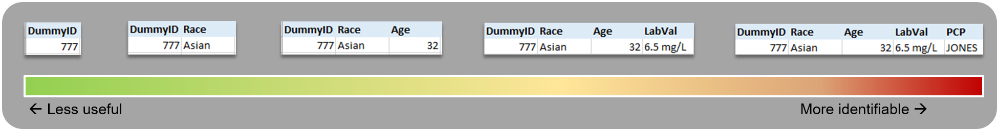

**ICEES Integrated Feature Tables**

ICEES integrated feature tables contain clinical data on patients from the UNC Health and environmental exposures data from a variety of public sources. The clinical and exposures data are integrated at the patient and visit level. Patient- and visit-level tables are defined by ‘study’ periods (i.e., calendar years). The initial use case driving R&D of ICEES was asthma. The ICEES asthma instance exposes data derived from ~160,000 patients with an asthma-like condition in the UNC Health Care System. Of note, however, is that ICEES is not restricted to patients with asthma-like conditions. Indeed, ICEES supports additional use cases on primary ciliary dyskinesia (PCD) and related rare pulmonary disorder; coronavirus (COVID) infection and Long COVID, and drug-induced liver injury (DILI).

The integrated feature tables are created via a custom software application pipeline. CAMP FHIR (Clinical Asset Mapping Program for FHIR), to transform clinical data from common data models (e.g., i2b2, PCORnet, OMOP) into HL7 Fast Healthcare Interoperability Resource (FHIR) files (Pfaff et al. 2019). A subsequent custom software application, FHIR PIT (Patient data Integration Tool), then integrates the clinical data with environmental exposures data from multiple sources before stripping the data of PHI and binning feature variables to create ICEES tables (Xu et al. 2020). Of note, FHIR PIT is modular and extensible and can be adapted for virtually any type of data that is of interest to clinical researchers and requires geocodes, dates, and identifiers for integration with EHR data.

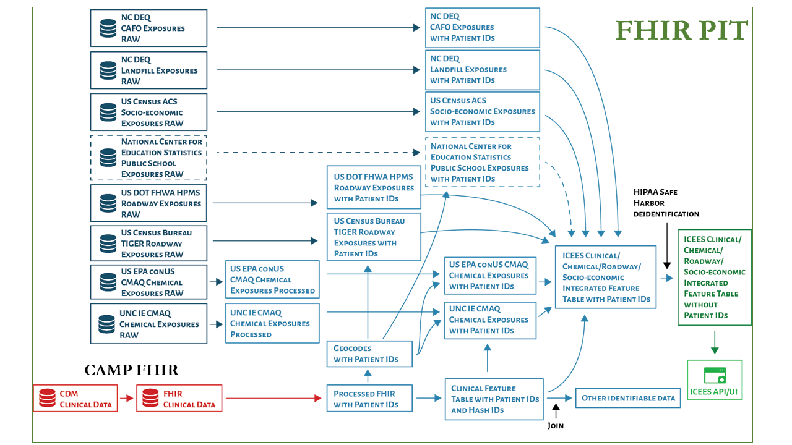

With ICEES, regulatory issues were addressed primarily by binning or recoding the data and presenting the data to users in aggregate form only

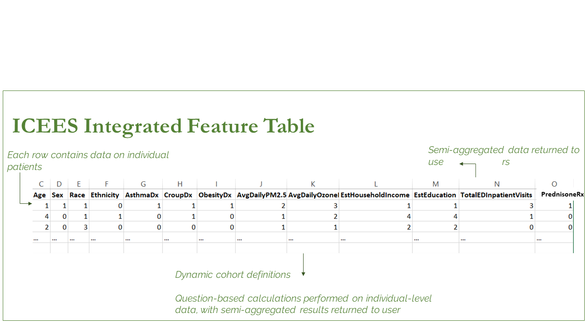

ICEES is accessible via an OpenAPI.

**ICEES Four Main Functionalites**
1. Cohort discovery: users define a cohort using any number of defined feature variables as input parameters, and the service returns a sample size.
2. Feature-rich cohort discovery: users select a predefined cohort as the input parameter, and the service returns a profile of that cohort in terms of the available feature variables.
3. Hypothesis-driven 2 x 2 feature associations: users select a predefined cohort and two feature variables, and the service returns a 2 x 2 feature table with a corresponding Chi Square statistic and P value.
4. Exploratory 1 X N feature associations: users select a predefined cohort and a feature variable of interest, and the service returns a 1 x N feature table with corrected Chi Square statistics and associated P values.

*New functionalities continue to be added. For instance, ICEES supports the generation of a multivariate table that supports the application of statistical models and machine learning algorithms (Fecho et al. 2021; Lan et al. 2021).

**ICEES API**
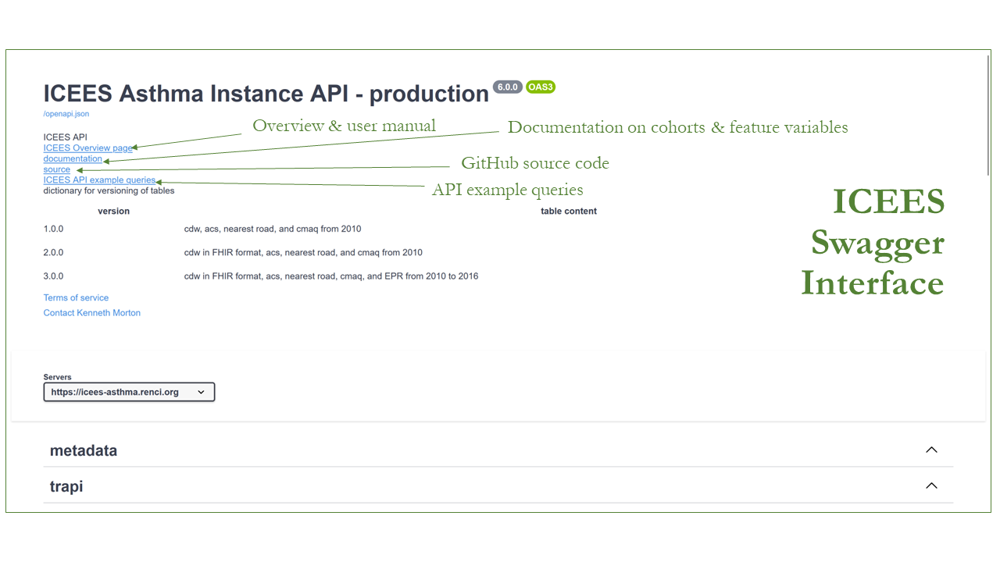

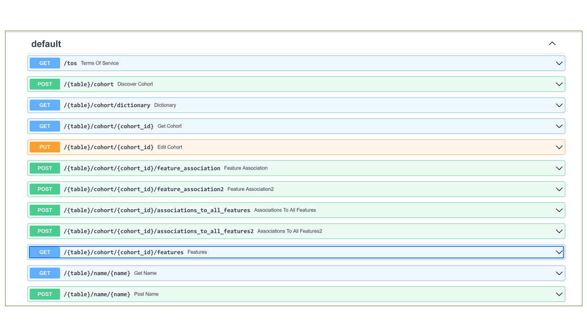

**Functionality 1: Cohort Discovery**

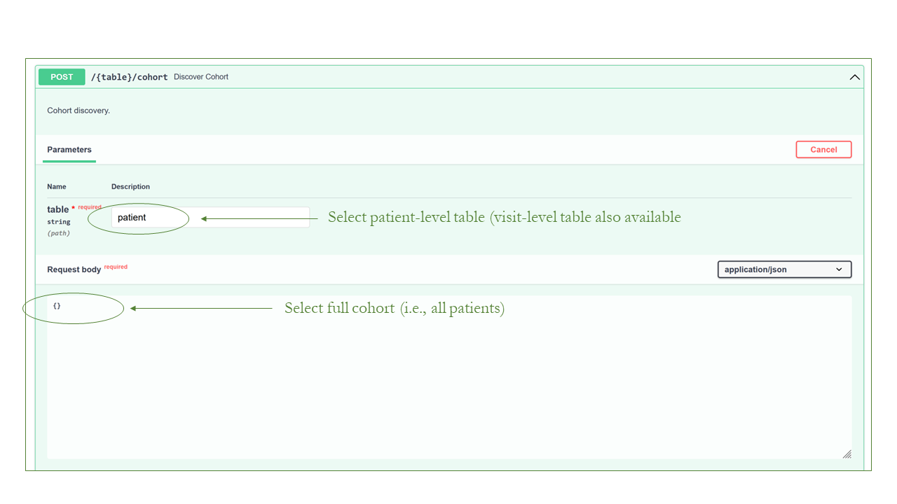

Shown below is the API output for the above request.

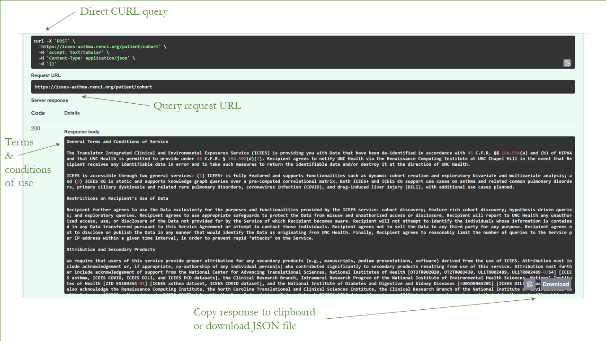

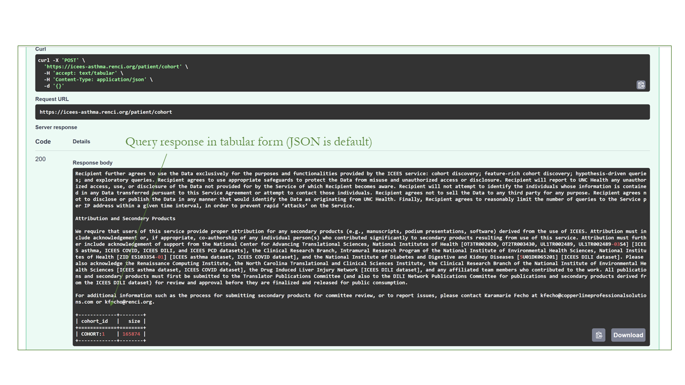

Below is a more focused query and response.

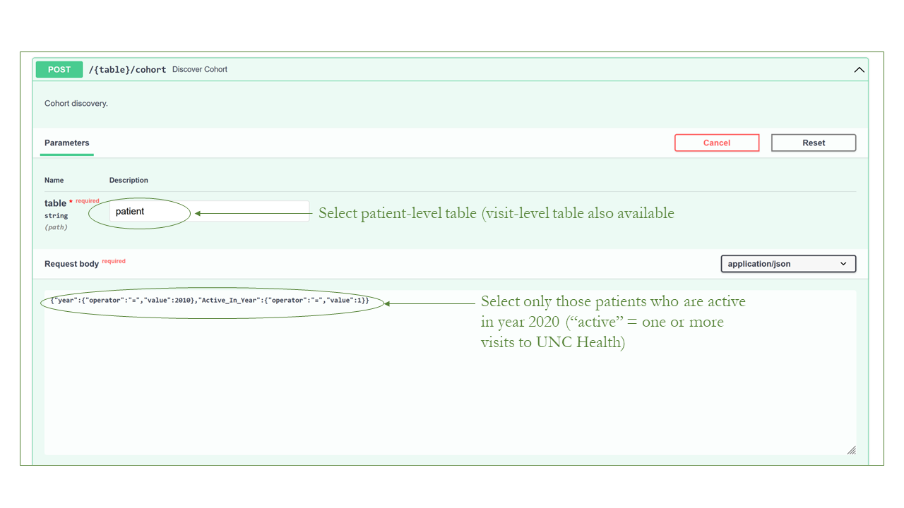

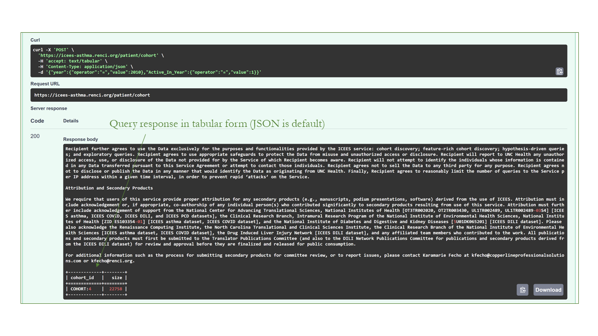

**Functionality 2: Feature-rich Cohort Discovery**

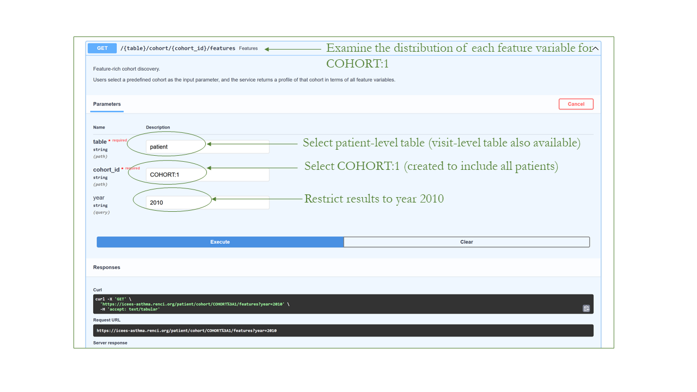

Shown below is the API output for the above request. In this case, the age distribution for COHORT:1 is provided. Note, however, that statistics are returned for all available feature variables

**Functionality 3: Hypothesis-driven 2 x 2 Feature Associations**

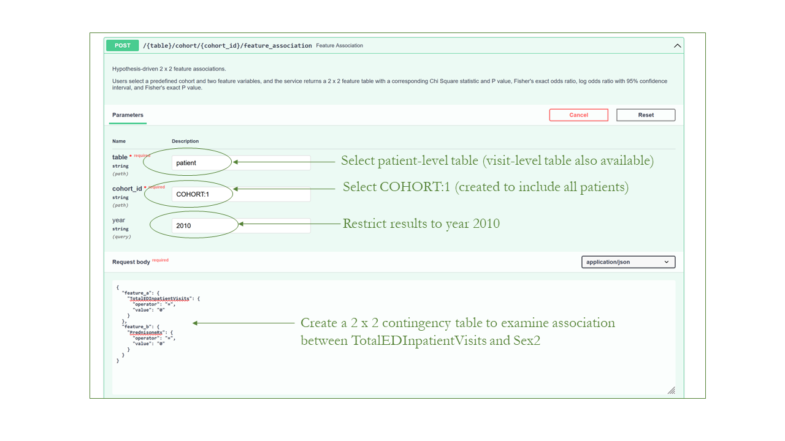

Shown below is the API output for the above request. This example shows that for patients with asthma-like conditions (N = 22,810 in year 2010), 17% of those who were prescribed/administered prednisone had >=2 annual ED or inpatient visits for respiratory issues vs 6% of those were not prescribed/administered prednisone (P < 0.0001).

Prednisone use is a common indicator of a patient with severe asthma.

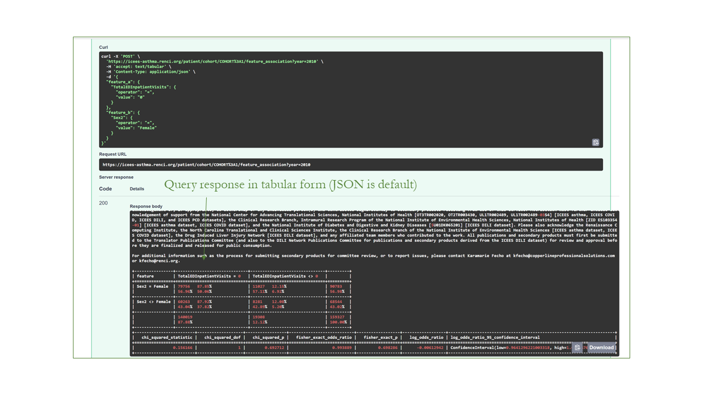

**Functionality 4: Exploratory 1 X N Feature Associations**

Shown below is the API output for the above request. This example shows that for patients with asthma-like conditions (N = 23,093 in year 2010, v1.0.0), the percentage of patients with >=2 ED or inpatient visits for respiratory issues increases with increasing levels of exposure to particulate matter <=2.5-microns in diameter (P < 0.0001). The non-linearity of the exposure-response curve imposed by Bin 5 reflects the fact that only 11 patients were binned into that exposure category. A new ICEES feature accounts for this issue by allowing users to collapse contiguous bins and/or choose from a variety of binning strategies via the selection of feature variables (see ICEES documentation).

## ICEES OpenAPIs

[ICEES Asthma Instance](https://perma.cc/7RWE-78JL)

[ICEES PCD Instance](https://perma.cc/9MBG-PAY7)

[ICEES COVID Instance](https://perma.cc/2EEG-X83)

[ICEES DILI Instance](https://perma.cc/Q5S4-XW5U)

## References

1.	Fecho K, Ahalt SC, Knowles M, Krishnamurthy A, Leigh M, Morton K, Pfaff E, Wang M, Yi H. Leveraging open electronic health record data and environmental exposures data to derive insights into rare pulmonary disease. Front Artif Intell 2022; 5:918888 (special issue on Biomedical Informatics Applications in Rare Diseases). doi: 10.3389/frai.2022.918888. *Apart from the first author, all authors are listed in alphabetical order.

2.	Fecho K,* Ahalt SC, Appold S, Arunachalam S, Pfaff E, Stillwell L, Valencia A, Xu H, Peden D. Development and application of an open tool for sharing and analyzing integrated clinical and environmental exposures data: asthma use case. JMIR Form Res 2022;6(4):e32357. doi: 10.2196/32357. *Apart from first/lead and last/senior author, all other authors are listed in alphabetical order.

4.	Lan B,* Haaland P, Krishnamurthy A, Peden DB, Schmitt PL, Sharma P, Sinha M, Xu H, Fecho K. Open application of statistical and machine learning models to explore the impact of environmental exposures on health and disease: an asthma use case. Int J Environ Res Public Health 2021;18(21):11398 [published as part of a special issue titled “Application of Biostatistical Modelling in Public Health and Epidemiology”]. doi: 10.3390/ijerph182111398. *Apart from first/lead and last/senior author, all other authors are listed in alphabetical order.

5.	Fecho K,* Haaland P, Krishnamurthy A, Lan B, Ramsey S, Schmitt PL, Sharma P, Sinha M, Xu H. An approach for open multivariate analysis of integrated clinical and environmental exposures data. Inform Med Unlocked 2021;26:100733. doi.org/10.1016/j.imu.2021.100733. *Apart from first/lead author, all other authors are listed in alphabetical order.

6.	Valencia A, Stillwell L. Appold S, Arunachalam S, Cox S, Xu H, Schmitt CP, Schurman SH, Garantziotis S, Xue W, Ahalt SC, Fecho K. Translator Exposure APIs: open access to data on airborne pollutant exposures, roadway exposures, and socio-environmental exposures and use case application. IJERHP 2020;17(14):5243. doi.org/10.3390/ijerph17145243. 

7.	Xu H, Cox S, Stillwell L, Pfaff E, Champion J, Ahalt SC, Fecho K. FHIR PIT: an open software application for spatiotemporal integration of clinical data and environmental exposures data. BMC Med Inform Decis Mak 2020;20:article 53. doi: 10.21203/rs.2.19633/v1.

8.	Pfaff ER, Champion J, Bradford RL, Clark M, Xu H, Fecho K, Krishnamurthy A, Cox S, Chute CG, Overby Taylor C, Ahalt S. Fast Healthcare Interoperability Resources (FHIR) as a meta model to integrate common data models: development of a tool and quantitative validation study. JMIR Med Inform 2019;7(4):e15199. doi: 10.2196/15199.

10.	Ahalt SC,* Chute CG, Fecho K, Glusman G, Hadlock J, Solbrig H, Overby-Taylor C, Pfaff E, Ta C, Tatonetti N, Weng C, and The NCATS Biomedical Data Translator Consortium. Clinical data: sources and types, regulatory constraints, applications. Clin Transl Sci 2019;12(4):329–333. doi: 10.1111/cts.12638. [K. Fecho, lead author] *All authors are listed in alphabetical order.

10.	Fecho K, Pfaff E, Xu H, Champion J, Cox S, Stillwell L, Bizon C, Peden D, Krishnamurthy A, Tropsha A, Ahalt SC. A novel approach for exposing and sharing clinical data: the Translator Integrated Clinical and Environmental Exposures Service. J Am Med Inform Assoc 2019;26(10):1064–1073. doi: 10.1093/jamia/ocz042. 

