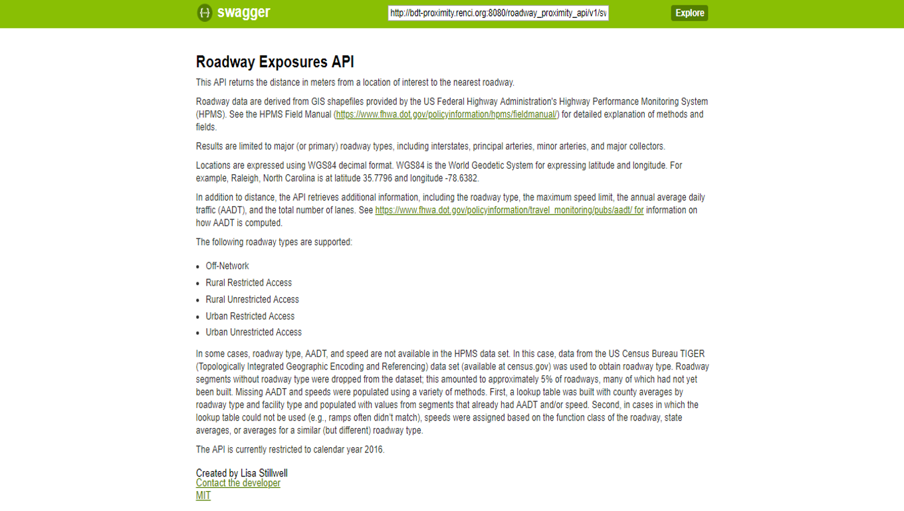
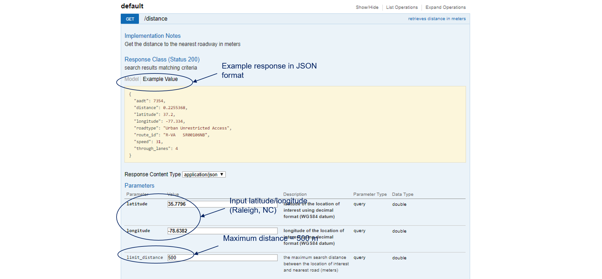

## Overview

[**Roadway Exposures API**](http://bdt-proximity.renci.org:8080/roadway_proximity_api/v1/ui/#!/default/get_distance)

This API returns the distance in meters from a location of interest to the nearest roadway.

Roadway data are derived from GIS shapefiles provided by the US Federal Highway Administration's Highway Performance Monitoring System (HPMS). See the HPMS Field Manual (https://www.fhwa.dot.gov/policyinformation/hpms/fieldmanual/) for detailed explanation of methods and fields.

Results are limited to major (or primary) roadway types, including interstates, principal arteries, minor arteries, and major collectors.

Locations are expressed using WGS84 decimal format. WGS84 is the World Geodetic System for expressing latitude and longitude. For example, the Statue of Liberty in New York City is at latitude 40.689249 and longitude -74.044500

In addition to distance, the API retrieves additional information, including the roadway type, the maximum speed limit, the annual average daily traffic (AADT), and the total number of lanes. See https://www.fhwa.dot.gov/policyinformation/travel_monitoring/pubs/aadt/ for information on how AADT is computed.

The following roadway types are supported:

- Off-Network
- Rural Restricted Access
- Rural Unrestricted Access
- Urban Restricted Access
- Urban Unrestricted Access

In some cases, roadway type, AADT, and speed are not available in the HPMS data set. In this case, data from the US Census Bureau TIGER (Topologically Integrated Geographic Encoding and Referencing) data set (available at census.gov) was used to obtain roadway type. Roadway segments without roadway type were dropped from the dataset; this amounted to approximately 5% of roadways, many of which had not yet been built. Missing AADT and speeds were populated using a variety of methods. First, a lookup table was built with county averages by roadway type and facility type and populated with values from segments that already had AADT and/or speed. Second, in cases in which the lookup table could not be used (e.g., ramps often didn’t match), speeds were assigned based on the function class of the roadway, state averages, or averages for a similar (but different) roadway type.

The API is currently restricted to calendar year 2016.

## User Manual

The screenshot below provides a textual overview of the Roadway Exposures API.

This screenshot provides default settings and example output from the API.

