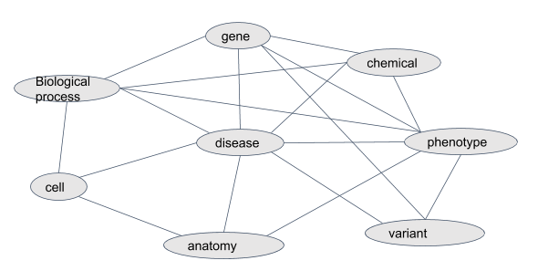
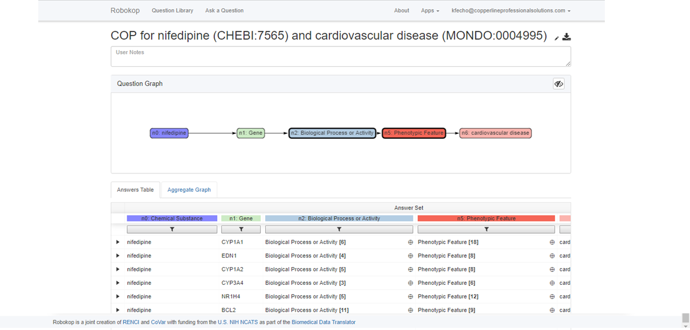
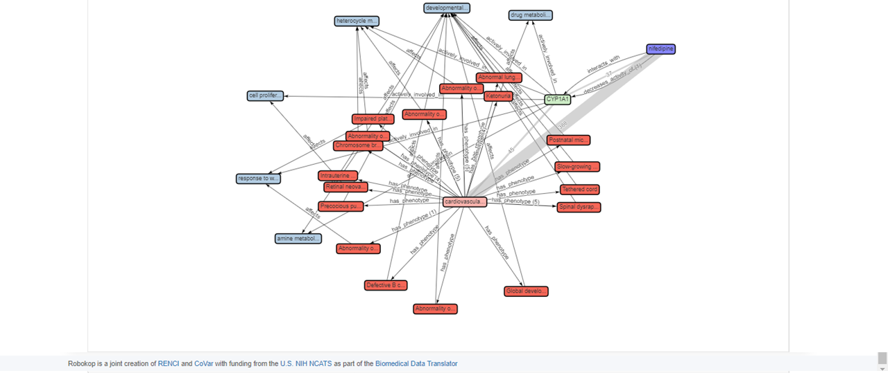
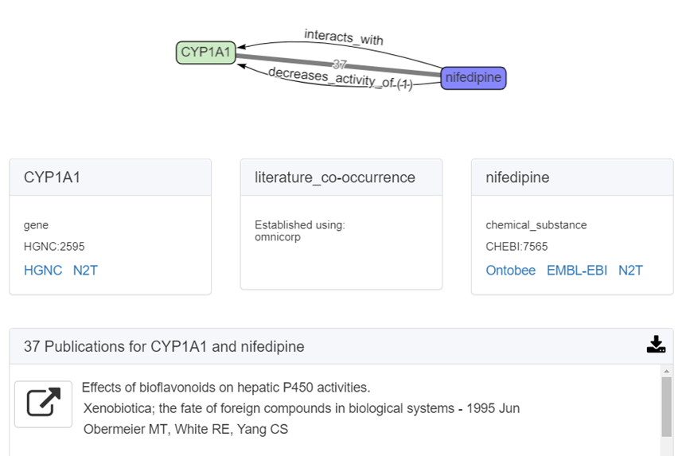
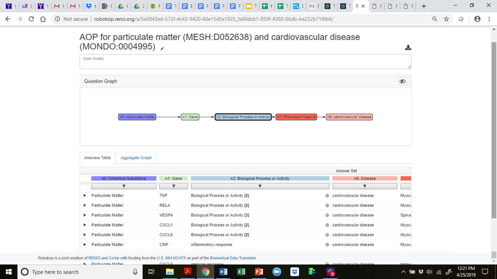
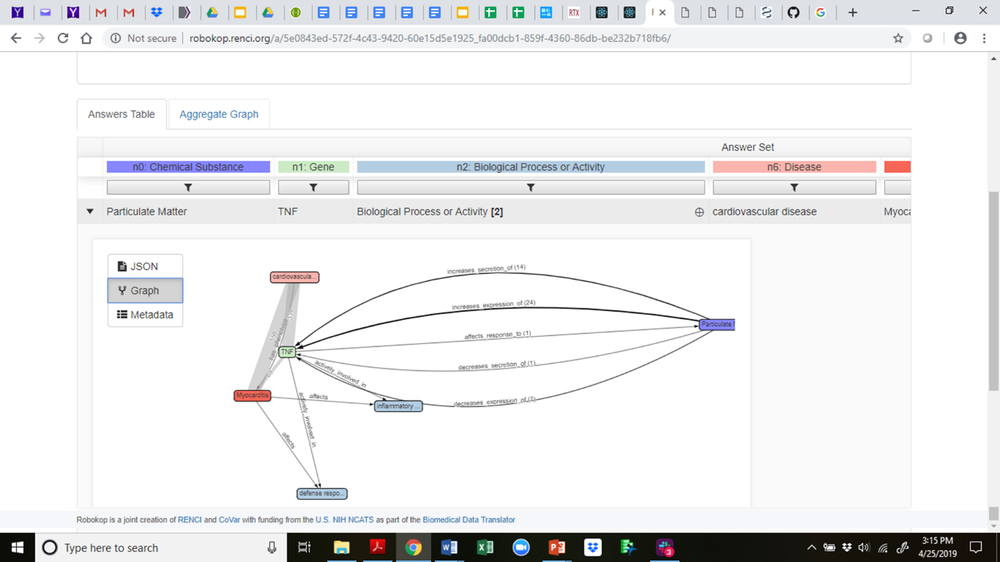
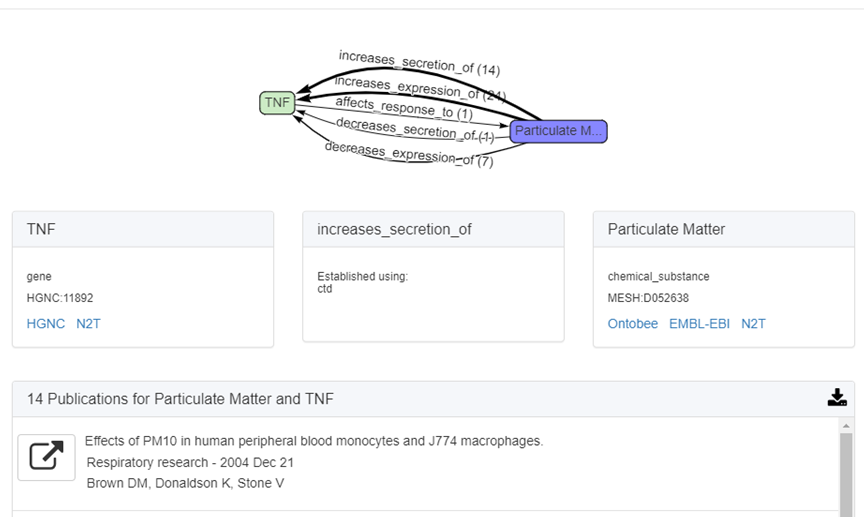

## Overview

[**ROBOKOP**](robokop.renci.org)

[ROBOKOP](http://robokop.renci.org/) (**R**easoning **O**ver **B**iomedical **O**bjects linked in **K**nowledge **O**riented **P**athways) is an open question-answering system, built upon multiple open biomedical databases and designed to explore relationships between a variety of biomedical data types. [RENCI](https://renci.org/) and collaborators at CoVar Applied Technologies developed ROBOKOP as part of the Translator program. With ROBOKOP, varied biomedical data are semantically integrated into a Knowledge Graph (KG) that provides access to high-level concepts connected by Knowledge Sources. Nodes in the graph represent entities such as chemical substance, gene, biological pathway or process, cell type, anatomical structure or system, and disease. Edges between nodes provide predicates that explain the association between the connected nodes; the predicates include concepts such as “treats”, “causes”, or “is associated with”. Edges also provide publication support for connections between nodes, i.e., co-occurrence of terms in PubMed abstracts. Using a structured query language, users posit questions, such as: “Why does imatinib help people with asthma?” “Why does clonidine interact with propranolol?” “Why is sickle cell disease protective against malaria?” ROBOKOP then locates applicable answer subgraphs in its KG and scores these putative answers, allowing users to view the results and supporting evidence (i.e., PubMed literature citations).

The ROBOKOP KG contains approximately 500,000 nodes (entities) and 12M edges (relationships).  A publicly available version of the database can be accessed at http://robokopkg.renci.org. A simplified version of the KG schema is shown below. An edge connecting two entities means that one or more data sources connecting entities of those types has been integrated into the ROBOKOP KG.

### ROBOKOP Queries for COPs

ROBOKOP can respond to arbitrary graph queries across biomedical topics. Of specific relevance to the proposed work, ROBOKOP is being used to explore a variety of COPs and AOPs. [Aside: ROBOKOP’s ability to generate comprehensive COPs using a KG-based system was one of several criteria for the Translator award. Of note, this capability was developed and a prototype was released in less than six months.] For example, ROBOKOP was used to generate a COP designed to investigate the MOA of nifedipine in the treatment of cardiovascular disease. This question was posed to ROBOKOP as a graph query finding a linear path starting at nifedipine and ending at cardiovascular disease, and traversing a specified set of node types in between:

    nifedipine ⇨ gene ⇨ *biological process or activity ⇨ *phenotypic feature ⇨ cardiovascular disease.

The stars indicate that for these entities, the path is allowed to branch, so that, e.g., multiple phenotypes may be involved.

As seen in the screenshot above, multiple answers, representing different paths through the KG are returned. These potential answers are scored and ranked through an algorithm that factors in the number of supporting PubMed publications, as well as indirect support provided by literature co-occurrence of all pairwise sets of terms in the path. The top answer for this COP is shown below.

Users can interact with the graph and explore the supporting publications. In this case, ROBOKOP identified 37 PubMed articles as supporting evidence for the nifedipine -> CYP1A relationship in the first answer subgraph. (One additional article was provided from the underlying data source, in this case CTD.) Users can view the citations (the first one is shown below) and click on the button to the left of the reference to retrieve the full PubMed abstract.

### ROBOKOP Queries for AOPs

Similarly, ROBOKOP can be used to generate AOPs. The example below shows an AOP for the negative effects of particulate matter on cardiovascular disease.

The top answer subgraph for this AOP is shown below. In this example, ROBOKOP established a relationship between particulate matter and the TNF gene, with 47 total supporting PubMed publications and predicates that include “increases secretion”, “increases expression”, and “affects response”. In this answer subgraph, the supporting publications were derived from CTD.

The first citation for the relationship

nifedipine ⇨ increases secretion of ⇨ TNF

is shown below.

## User Manual

_Coming soon_

