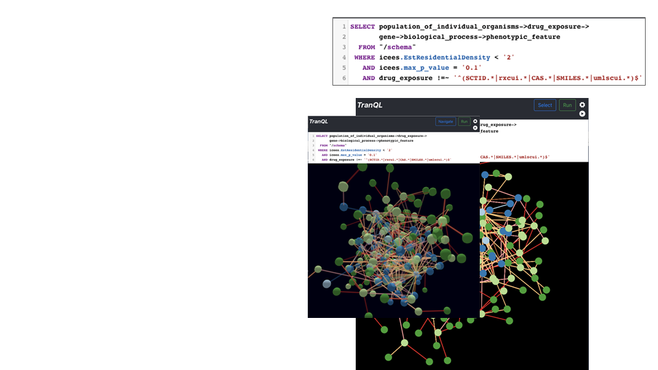
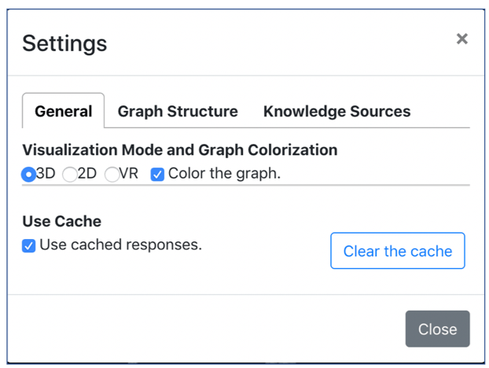
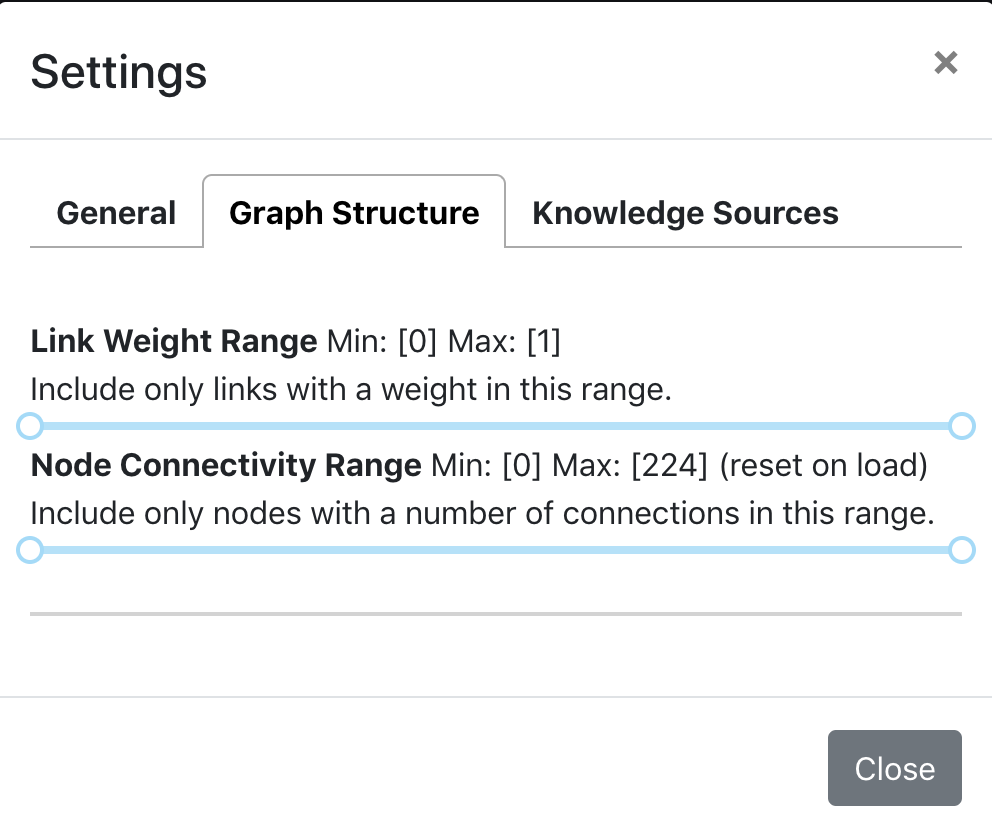
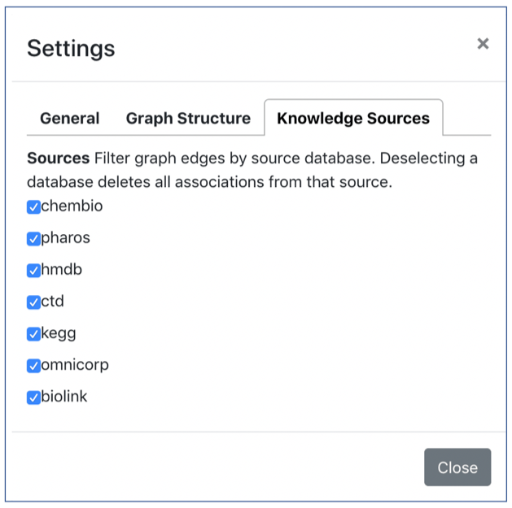
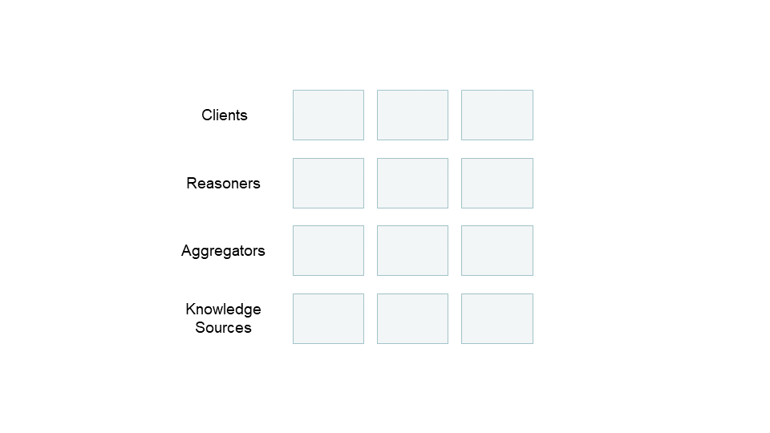

## Overview

[TranQL](https://tranql.renci.org/) (Translator Query Language) was recently developed by [RENCI](https://renci.org/) as a new query language for expressing graph-oriented queries over the common Translator Knowledge Graph Standard API presented by [ROBOKOP](/apps/robokop), [ICEES](/apps/icees), and other Translator “Reasoners”. TranQL offers a simple query and visualization interface to federated knowledge networks, with syntax that blends elements of relational and graph semantics to express a graph query and enable joins across Translator Reasoners. A simple, interactive user interface accepts a query in the TranQL query language, executes the query across one or more Reasoners, and visualizes the resulting KG. An example of a TranQL query and resultant KG is shown below. Here, TranQL was used to join [ICEES](/apps/icees) and [ROBOKOP](/apps/robokop) and explore relationships between patients with asthma who are vs are not responsive to treatment (as defined by emergency department or inpatient visits for respiratory issues), their chemical exposures, and the downstream gene targets, biological processes, and phenotypic features associated with those exposures. This is a query that asks: for patients in [ICEES](/apps/icees) with asthma-like conditions who are vs are not responsive to treatment (as defined by ED/inpatient visits for respiratory issues), what are their chemical exposures and what are the gene targets, biological processes, and phenotypic features associated with those chemical exposures. Highlighted is an example of one such phenotypic feature, namely, abnormal glucose homeostasis. Note that the first part the workflow invoke [ICEES](/apps/icees), whereas the second part invokes [ROBOKOP](/apps/robokop). TranQL is NOT specific to [ICEES](/apps/icees) and [ROBOKOP](/apps/robokop), however, but rather can serve as a bridge across Translator Reasoners to provide workflow automation and interactive visualization of output.

As a brand new tool, TranQL is only now being implemented and evaluated in driving use cases such as the one described above. However, we expect this tool to have broad applicability across the Translator program, including application across other open Translator Clinical Knowledge Sources (e.g., [Columbia Open Health Data](http://smart-api.info/ui/9fbeaeabd19b334fa0f1932aa111bf35), [Clinical Profiles](https://model.clinicalprofiles.org/clinicalprofile.html)).

## User Manual

TranQL supports the interactive query of Translator “Reasoners”. Its simple user interface accepts a query in the TranQL query language. Running the query interacts with one or more Reasoners to build and visualize a resulting Knowledge Graph. The first thing to do is to create a query. The query editor supports automatic command completion for keywords and for concepts and relations in the Biolink-model. In the figure, the user has entered Control-Space to find terms that begin with “chemical_”. A drop down shows all available options. The up and down arrows can be used to navigate the list. Each query selects a graph made up of concepts and relationships between them. The query’s from clause specifies a web service that will be called to satisfy the query. Queries can also contain where clauses that refine the search by specifying values for the concepts and relations. TranQL interprets these elements to build a request to a service supporting the Translator Knowledge Graph Standard (KGS) graph query API. Running a query can take a long time. A busy indicator will display while the query is executing. If successful, a knowledge graph will be rendered.

**Clinical Query:** The previous example queried a single service. In this example, we create a query that must span more than one service. The first portion of the query graph relates a population of individual organisms to a drug exposure. The [ICEES](/apps/icees) Clinical Reasoner provides data linking these concepts. Given a drug exposure concept, the rest of the query navigates through biologial process to phenotypic feature. This second set of connections is provided by the [ROBOKOP](/apps/robokop) Ontological Reasoner.

**Schema:** TranQL’s configuration models the schema of multiple reasoners. [ROBOKOP](/apps/robokop) exports its schema as a [hierarchy of Biolink-model elements](http://robokop.renci.org/api/operations) detailing the transitions it supports. Importing this kind of information about each configured reasoner allows the TranQL query planner to compare each link in a question graph to knowledge links provided by each of the constituent schemas. In this case, it creates a plan that goes to [ICEES](/apps/icees) for the first segment of the question, then hands off the results to the second segment which it sends to [ROBOKOP](/apps/robokop). Consulting the schema is triggered by specifying “/schema” in the from clause.

**Options:** The KGS standard API contains a Message object with several parts. One is a list of optional values. The elements of the where clause prefixed with “icees” in the example will be sent as options in the KGS query to [ICEES](/apps/icees).

**Filters:** The final component of the where clause is a regular expression-based filter. The “!=~” operator essentially means “does not match”. In this context, by applying it to the drug_exposure element, we’re instructing the query to eliminate any drug exposure results whose identifiers contain the specified components. We’re doing this because [ICEES](/apps/icees) returns many results with identifiers that can’t be processed by downstream services. To accelerate the query, we skip handling them.

**General Settings:** The application’s settings can be used to switch between 3D and 2D visualization modes. Whether the graph if colorized is also optional. Knowledge Graphs are cached at the client. This means that running a successful query a second time will load results already retrieved by the first execution from the client machine’s disk. Settings can be used to clear the entire application cache for all queries. This will result in new service invocations when a query is run. Alternatively, the cache can be bypassed entirely by disabling it using the checkbox in the general settings dialog.

**Graph Structure Editor:** Application settings also support restricting the range of link weights in the graph that will be rendered. Only links with a weight between the selected minimum and maximum values will be rendered. All links in the result graph remain stored in the cache. This control affects rendering only. A range of node connectedness can also be configured via the settings. The upper limit is dynamically set to the number of nodes in the answer graph each time a query is run. For both settings, the values are dynamically updated and rendered in the settings dialog. Changes to the graph occur immediately. Because the underlying answer graph is cached, restoring the original settings restores the original answer graph.

Knowledge Source Selector: The Knowledge Sources settings tab displays all Knowledge Sources that were used to generate the current answer set. Deselecting a Knowledge Source deletes all edges from the graph that originated with that source.

**TranQL in relation to Translator**

