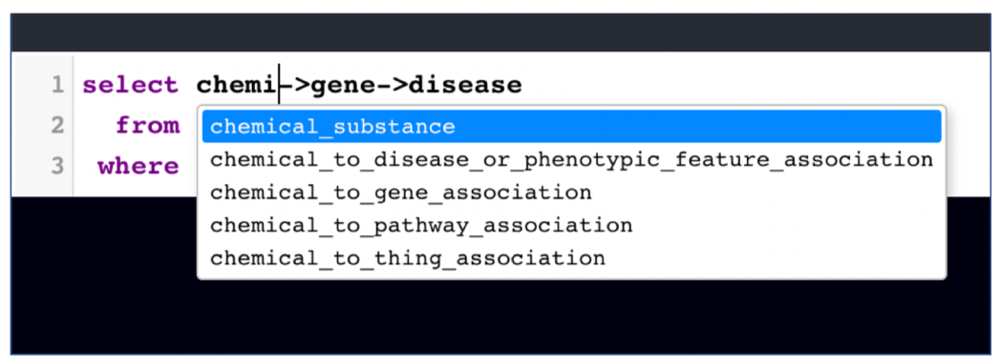
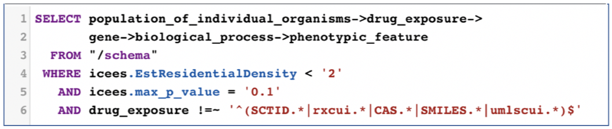
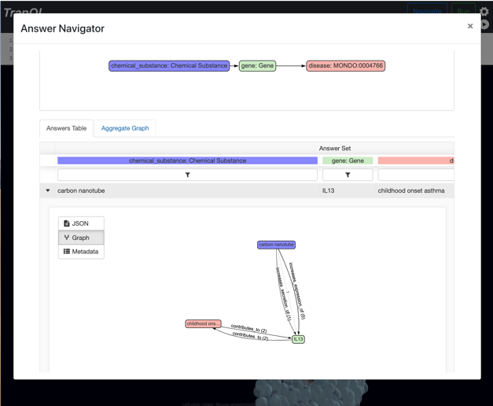
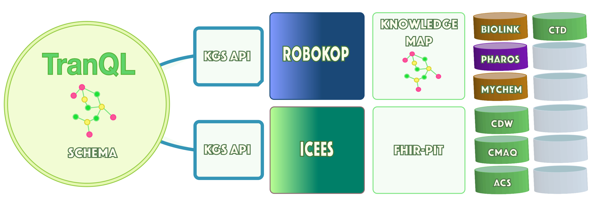

## TranQL

## Overview

[**ranQL**](http://tranql.renci.org/) (Translator Query Language) is an interactive environment for the iterative exploration of federated knowledge graphs with semantically rich visualizations. It queries knowledge models from multiple Translator reasoners federeated into unified schemas. The user interface supports iteratively querying, caching, visualizing, modifying, and requerying data across the federation. Completed queries can be incorporated into software systems requiring parameterized automation of the Translator semantic network.

TranQL was developed by [RENCI](https://renci.org/) to automate graph-oriented queries over Translator Knowledge Graph Standard (KGS) API services. The KGS API is the interface presented by [ROBOKOP](/apps/robokop), [ICEES](/apps/icees), and other Translator “Reasoners”. TranQL offers a  query and visualization interface to federated knowledge networks, with syntax that blends elements of relational and graph semantics to express a graph query and enable joins across Translator Reasoners. A simple, interactive user interface accepts a query in the TranQL query language, executes the query across one or more Reasoners, and visualizes the resulting KG.

An example of a TranQL query and resultant KG is shown below. Here, TranQL was used to join results from [ICEES](/apps/icees) and [ROBOKOP](/apps/robokop) and explore relationships between patients with asthma who are vs are not responsive to treatment (as defined by emergency department or inpatient visits for respiratory issues), their chemical exposures, and the downstream gene targets, biological processes, and phenotypic features associated with those exposures.

The query asks: for patients in [ICEES](/apps/icees) with asthma-like conditions who are vs are not responsive to treatment (as defined by ED/inpatient visits for respiratory issues), what are their chemical exposures and what are the gene targets, biological processes, and phenotypic features associated with those chemical exposures. Note that the first part the workflow invokes [ICEES](/apps/icees) and the second part invokes [ROBOKOP](/apps/robokop).


TranQL is not specific to [ICEES](/apps/icees) and [ROBOKOP](/apps/robokop). Rather can serve as a bridge across Translator Reasoners to provide workflow automation and interactive visualization of output.

As a new tool, TranQL is now being implemented and evaluated in driving use cases such as the one described above. However, we expect this tool to have broad applicability across the Translator program, including application across other open Translator Clinical Knowledge Sources (e.g., [Columbia Open Health Data](http://smart-api.info/ui/9fbeaeabd19b334fa0f1932aa111bf35), [Clinical Profiles](https://model.clinicalprofiles.org/clinicalprofile.html)).

## User Manual

TranQL supports the interactive query of Translator “Reasoners”. Its simple user interface accepts a query in the TranQL query language. Running the query interacts with one or more Reasoners to build and visualize a resulting Knowledge Graph. The first thing to do is to create a query. The query editor supports automatic command completion for keywords and for concepts and relations in the Biolink-model. In the figure, the user has entered Control-Space to find terms that begin with “chemical_”. A drop down shows all available options. The up and down arrows can be used to navigate the list.



Each query selects a graph made up of concepts and relationships between them. The query’s from clause specifies a web service that will be called to satisfy the query. Queries can also contain where clauses that refine the search by specifying values for the concepts and relations. TranQL interprets these elements to build a request to a service supporting the Translator Knowledge Graph Standard (KGS) graph query API. Running a query can take a long time. A busy indicator will display while the query is executing. If successful, a knowledge graph will be rendered.


**Clinical Query:** The previous example queried a single service. In this example, we create a query that must span more than one service. The first portion of the query graph relates a population of individual organisms to a drug exposure. The [ICEES](/apps/icees) Clinical Reasoner provides data linking these concepts. Given a drug exposure concept, the rest of the query navigates through biologial process to phenotypic feature. This second set of connections is provided by the [ROBOKOP](/apps/robokop) Ontological Reasoner.



**Schema:** TranQL’s configuration models the schema of multiple reasoners. [ROBOKOP](/apps/robokop) exports its schema as a [hierarchy of Biolink-model elements](http://robokop.renci.org/api/operations) detailing the transitions it supports. Importing this kind of information about each configured reasoner allows the TranQL query planner to compare each link in a question graph to knowledge links provided by each of the constituent schemas. In this case, it creates a plan that goes to [ICEES](/apps/icees) for the first segment of the question, then hands off the results to the second segment which it sends to [ROBOKOP](/apps/robokop). Consulting the schema is triggered by specifying “/schema” in the from clause.

**Options:** The KGS standard API contains a Message object with several parts. One is a list of optional values. The elements of the where clause prefixed with “icees” in the example will be sent as options in the KGS query to [ICEES](/apps/icees).

**Filters:** The final component of the where clause is a regular expression-based filter. The “!=~” operator essentially means “does not match”. In this context, by applying it to the drug_exposure element, we’re instructing the query to eliminate any drug exposure results whose identifiers contain the specified components. We’re doing this because [ICEES](/apps/icees) returns many results with identifiers that can’t be processed by downstream services. To accelerate the query, we skip handling them.


**Answer Viewer:**  Once a knowledge graph is loaded in TranQL, it can be analyzed as individual answers, they're subgraphs, and associated literature. This is vital since the knowledge graph aggregates a number of paths ranked by reasoners. The ROBOKOP users lets users analyze each path in detail. This integration also demonstrates how use of the KGS standard makes it possible to leverage capabilities from across the program. TranQL stores a KGS standard knowledge graph. Any service that accepts one can be incorporated. 



**General Settings:** The application’s settings can be used to switch between 3D and 2D visualization modes. Whether the graph if colorized is also optional. Knowledge Graphs are cached at the client. This means that running a successful query a second time will load results already retrieved by the first execution from the client machine’s disk. Settings can be used to clear the entire application cache for all queries. This will result in new service invocations when a query is run. Alternatively, the cache can be bypassed entirely by disabling it using the checkbox in the general settings dialog.


**Graph Structure Editor:** Application settings also support restricting the range of link weights in the graph that will be rendered. Only links with a weight between the selected minimum and maximum values will be rendered. All links in the result graph remain stored in the cache. This control affects rendering only. A range of node connectedness can also be configured via the settings. The upper limit is dynamically set to the number of nodes in the answer graph each time a query is run. For both settings, the values are dynamically updated and rendered in the settings dialog. Changes to the graph occur immediately. Because the underlying answer graph is cached, restoring the original settings restores the original answer graph.

[]()

**Knowledge Source Selector:**## Conclusion

 The Knowledge Sources settings tab displays all Knowledge Sources that were used to generate the current answer set. Deselecting a Knowledge Source deletes all edges from the graph that originated with that source. Edges may contain more than one data source in the event that an edge originated from more than one place. If an edge contains any source that is deselected, it will not be rendered in the graph.

[]()

## Architecture

TranQL comprises a query engine and user interface.

#### Language and Query Engine

The query engine incorporates a lexical analyzer, parser and abstract syntax tree, and interpreter. The lexical analyzer accepts a language similar to Structured Query Language (SQL) and therefore familiar and easy to parameterize. It is different from SQL in that, instead of selecting lists of columns, TranQL selects graph expressions. The lexical analyzer transmits tokens to the parser which generates an abstract syntax tree (AST). The interpreter generates invocations of the KGS API based on this AST and executes the query.

#### Cross Reasoner Knowledge Schemas

When the query specifies a KGS endpoint in the `where` clause, the interpreter sends reqeusts to that endpoint only. But it's also possible to specify a schema in the where clause. A TranQL schema is a configuration linking the knowledge models of multiple reasoners. TranQL will plan a query to use reasoners in the schema able to answer fragments of the query. It will also handle linking the outputs of one query fragment to other fragments (sometimes referred to as handoff).

A reasoner's schema describes the kinds of triples it is able to form. The Translator standard form for a reasoner schema looks like this:
```
    "gene": {
        "chemical_substance": [
            "directly_interacts_with",
            "decreases_activity_of",
            ...
            "chemical_targets_gene"
        ],
        "biological_process_or_activity": [
            "actively_involved_in",
            "contributes_to",
        ...
```
where the first two layers are entities from the BioLink-Model and the third level are relationships from the model.

A TranQL schema links these to enable cross reasoner query planning. The configuration file for the first TranQL schema is [here](https://github.com/NCATS-Tangerine/tranql/blob/master/tranql/conf/schema.yaml).

[]()

#### User Interface

##### Overview

The user interface is a single page application (SPA) build with React, CodeMirror, ForceGraph, three.js, and IndexedDB.

###### React

React is a popular framework for SPAs. It's used as the framework for the entire user interface.

###### CodeMirror

The query editor uses the CodeMirror library to provide autocomplete functionality, line numbers, and syntax highlighting, all of which make developng a query more intuitive. In addition to command completion for SQL syntax, it also understands BioLink-Model and is able to suggest completions.

###### force-graph

Force-graph is a graph visualization React component which supports 3D, 2D, and VR modes. It has an extensive API and makes working with the graph programmatically easy. It uses Three.js as the core renderer. Three.js is a JavaScript wrapper for WebGL, a GPU accelerated rendering engine. Hardware acceleration enables the visualization to do smooth interactive navigation of graphs with tens of thousands of nodes. Force directed graph layouts are also a best practice for visualization of complex graph since they mathematically sculpt the graph around interesting structural properties.

It also means that re-rendering the graph after changes is relatively inexpensive. The TranQL UI takes advantage of this in two main ways. The first is that it implements a rendering pipeline, that is, a chain of responsibility in which each element is able to edit the entire knowledge graph. Each rendering node is a JavaScript object and the entire rendering pipeline is called to produce the visualization. The filters in the settings dialog, like data source filtering, are implemented as nodes in the rendering pipeline.

The entire rendering pipeline is executed dynamically when changes are made to the filters in the settings dialog. The ability to do this with a large graph is an advantage of ForceGraph and Three.js.

###### IndexedDB

Caching data at the client has gone through evolutionary phases including localStorage and WebSQL. The latest, and significantly more capable, is IndexedDB which, among other advantages, allows much larger objects and supports full transactional semantics.

We use the Dexie.js library to interact with IndexedDB to store knowledge graphs. A knowledge graph can take a long time to build and transmit. So it's valuable to hold on to them for a while. The cache can be temporarily bypassed or entirely cleared from the general settings dialog.

TranQL is in active development. The next phase will replace the prototype implementation of a KGS interface to ICEES with the new, production quality KGS ICEES API. The next step will be to make cross schema integration more robust, demonstrate integration with a third reasoner endpoint, and add automated tests for query planning and other recent features.

