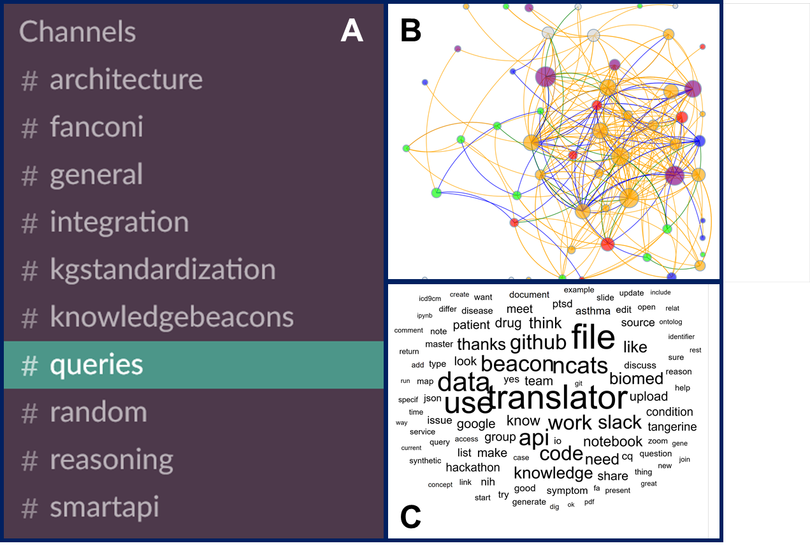

**Figure Caption.** Slack communications among the five initial Translator teams. Data were captured for 30+ Slack channels, including 10 channels (A) with substantial ongoing activity as of Spring 2018. The communication network (B) depicts individual contributors, with node colors representing Translator team colors and edge colors representing different types of communication. Node size is proportional to the sum of the number of links and the number of broadcast messages associated with each node. For interactive exploration, please see https://xdciviz.renci.org/translator/teamscience/slackviz. The word cloud (C) shows the 100 most frequently used words across Translator team communication messages on Slack over the same time period. The larger the word, the more frequently it was used.