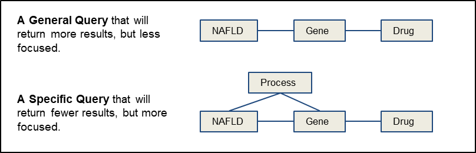

## Filling Knowledge Gaps – NAFLD

CB is a bioinformatician who is interested in learning more about the ways that Knowledge Graphs can be used to explore relationships between entities and address questions of relevance to translational research. An investigator that he works with is an expert on NAFLD (Non-Alcoholic Fatty Liver Disease), which is a condition that is caused by alcohol-independent accumulation of fat in liver cells and that has no approved drug treatments. As such, first-line therapy usually consists of dietary changes, exercise, and weight-loss programs. CB wishes to use [ROBOKOP](/apps/robokop) to search for drugs that may be useful in the treatment of NAFLD. His search of the [ROBOKOP](/apps/robokop) KG begins with a simple, general query: what drugs interact with genes known to be associated with NAFLD? However, CB realizes that genes may be peripherally associated with diseases. Thus, in an effort to focus the query on a subset of genes that are at the core of the disease, he adds a constraint; specifically, he requires that any associated genes must share a biological process with NAFLD, as depicted below.

The general query identified eight different genes among the top 20 answers (SREBF1, LDLR, NFE2L2, CYP2E1, PPARA, CYP1A2, CYP17A1, and GSTM1) and 15 chemicals, including drugs that are known to lower cholesterol or triglycerides (simvastatin, pirinixic acid, bezafibrate, clofibrate, fenofibrate), as well as drugs that are known to increase risk for NAFLD, such as phenobarbital. Adding the constraint that genes must share a biological process with NAFLD reduces the answer set to a single gene, LDLR, which shares with NAFLD the biological process "plasma lipoprotein particle clearance", and nine chemicals, including five statins, pirinixic acid, ciprofibrate, pioglitazone, and troglitazone. None of these chemicals directly target LDLR, but all have a downstream effect on the gene. Curiously, the suggested drugs are used to treat high cholesterol or diabetes... not NAFLD, although a couple of the drugs have database annotation indicating an association with NAFLD. CB thus conducts a quick search of the literature and finds evidence for off-label use of the identified drugs in the treatment of NAFLD, with a growing interest in formal evaluation of the drugs for efficacy in the treatment of NAFLD.

_**Translator-enabled drug discovery!**_

**References**

**Bizon C**, **Cox S**, **Balhoff J**, **Kebede Y**, **Wang P**, **Morton K**, **Fecho K**, **Tropsha A**. ROBOKOP KG AND KGB: Integrated Knowledge Graphs from Federated Sources. *JCIM*, under review.

**Morton K**, **Wang P**, **Bizon C**, **Cox S**, **Balhoff**, **Kebede Y**, **Fecho K**, **Tropsha A**. ROBOKOP: an abstraction layer and user interface for knowledge grpahs to support question answering. *Bioinformatics*, 2019. [doi:10.1093/bioinformatics/btz604](https://doi.org/10.1093/bioinformatics/btz604).
