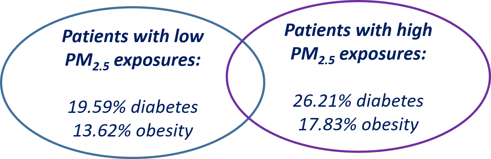

## Hackathon-derived Clinical Insights into the Relationship Between Sex, Obesity, Diabetes, and Airborne Exposures

DP is a translational scientist and practicing clinician who specializes in the treatment of asthma. A subset of his patients has severe asthma, with symptoms that do not respond to standard treatment. He has observed that many of these patients are female and also suffer from obesity and diabetes. Some of the patients appear to live in heavily populated areas and thus may be exposed to high levels of airborne pollutants. DP would like to formally explore the role of sex, obesity, diabetes, and airborne pollutant exposure in severe asthma. Specifically, he’d like to obtain empirical data on his clinical observations and generate sufficient preliminary data to submit an NIH grant proposal to support deeper exploration of preliminary findings. Thus, DP seeks observational clinical data that meet several criteria:

(1) the data must be openly accessible and readily available for exploratory research;

(2) the data must include a broad set of patient characteristics or phenotypes; and 

(3) the data must offer a sufficiently large sample size to provide enough statistical power to draw meaningful conclusions.

DP learns that [ICEES](/apps/icees) may fulfill the above requirements. He submits several ICEES queries, designed as 2 x 2 association tests, that asked: is there an association between exposure to high levels of PM2.5 (binned as (47.06, 114.94) vs (6.77, 47.06) µg/m3 average maximum daily exposure) and diabetes (diagnosis = yes vs no), obesity (diagnosis = yes vs no), or sex (male vs female) among patients with severe asthma (defined by prednisone treatment; N = 2,240)? The results showed that diabetes was more common among patients exposed to relatively high levels of PM2.5 than among patients exposed to relatively low levels of PM2.5 (26.21% vs 19.59%, P = 0.0002). Likewise, obesity was more common among patients exposed to relatively high levels of PM2.5 than among patients exposed to relatively low levels of PM2.5 (17.83% vs 13.62%, P < 0.01). No relationship was identified between sex and exposure to PM2.5.

Thus, DP was able to use ICEES to confirm and extend suspected interactions between exposure to airborne particulates and metabolic disorders such as obesity and diabetes (e.g., Eze et al. 2015).

Of note, this entire research study was conceptualized and executed in less than one week. A full-length manuscript describing this work and related work has been submitted for peer review to the *Journal of Biomedical Informatics* (Fecho et al., submitted to *Journal of Biomedical Informatics* for consideration as a Special Communication with approval from the Editor-in-Chief). A more rigorous follow-up study is proposed as part of DP’s NIH grant application.

**Translator hackathon-enabled clinical insights!**

**References:**

Eze IC, Hemkens LG, Bucher HC, Hoffmann B, Schindler C, Künzil N, Schikowski T, Probst-Hensch NM. Association between ambient air pollution and diabetes mellitus in Europe and North America: systematic review and meta-analysis. *Environ Health Perspect* 2015;123(5): 381–389. https://www.ncbi.nlm.nih.gov/pmc/articles/PMC4421762/.

Fecho K, Hadlock J*, Ta C, Xu H, Zhu R, Zhu Q, Arunachalum S, Champion J, Chute CG, Gersing K, Glusman G, Lee J, Pfaff E, Robinson M, Sid E, Peden DB and The Biomedical Data Translator Consortium. Sex, obesity, diabetes, and exposure to particulate matter: scientific insights revealed by analysis of open clinical data sources during a five day hackathon. *Journal of Biomedical Informatics*, submitted for consideration as a Special Communication. *Apart from the first/lead and last/senior authors, all other authors are listed in alphabetical order.
