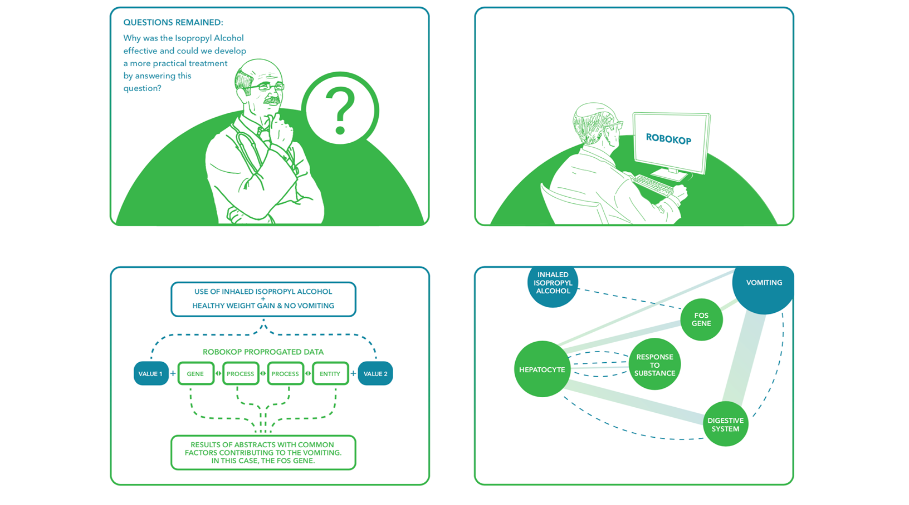

## COP for Isopropyl Alcohol and Cyclic Vomiting Disease

MM is part of a multidisciplinary team focused on rare diseases and comprised of practicing clinicians, translational scientists, computer scientists, and informaticians. The team was presented a challenging clinical use case involving a 19-year-old female, height 5'4" and weight 78 lbs, with a diagnosis of cyclic vomiting syndrome, a disease that she had been suffering from for years. Her doctors had tried many treatments over the years, but nothing seemed to stop or even reduce the episodes of emesis.

The team investigating the case happened to identify three publications that suggested an association between inhaled isopropyl alcohol and emesis. Out of desperation, and with the patient's consent to an experimental treatment with potential toxicity, the patient's doctors decided to initiate a trial.

Much to everyone's surprise, it worked! Five months after the trial was initiated, the patient reported zero episodes of emesis and an increase in weight to more than 100 lbs. The rare-disease team was thrilled but perplexed; after all, no one could provide an explanation of how inhaled isopropyl alcohol was effective in the treatment of cyclic vomiting syndrome. This was unfortunate because a better understanding of the chemical's MOA might yield insights into the etiology and pathophysiology of cyclic vomiting syndrome, as well as suggest treatments with improved safety and effectiveness.

Translator team members used [ROBOKOP](/apps/robokop) to generate a clinical outcome pathway (COP) and explore possible MOAs. An evaluation of the results led the Translator team to suggest to MM and his team that the clinical response is due to an interaction of isopropyl alcohol with the FOS gene-an explanation that logically made sense and had some literature support. The rare-disease team is now conducting a deep dive into the relationship between FOS, isopropyl alcohol, and emesis, in an effort to validate the relationship and identify potential drug targets.

> As Program Coordinator at PMI I work with patient cases and development or research plans and next steps for cases daily. A large portion of that work involves looking at specific gene targets and ways to compensate for a subsequent loss, lack of, or gain in specific gene or protein function and levels. We have a portion of cases that have been "stuck" for lack of better words where we have been unable to find recommendations or leads to chase for individuals. Since the addition of the ROBOKOP dataset, I along with other members of my team have had new query results that previous datasets could not generate, that have helped tremendously in the progress of these cases... As a result of the utility of the ROBOKOP data, our team is now going back through all of our current 283 cases and re-running them to see what new findings are returned.
>
> — Dr. JHB

_Translator-enabled insights into COPs!_

## Shared AOPs for Environmental Exposures

CS is a translational investigator on a long-term, longitudinal, large-scale effort designed to better define the genetic and environmental determinants of health and disease. The study involves nearly 20,000 participants and was initiated roughly 20 years ago. Participants provide DNA samples and survey data designed to collect information on health, family history of disease, environmental exposures, and lifestyle data. In a recent analysis of a subset of the data, investigators identified clusters of unexpected associations between subject-reported chemical exposures and immune-mediated diseases. In one cluster, the chemical exposures were three solvents&mdash;dichlorobenzene, acetone, and trichloroethylene&mdash;and the associated disease was ulcerative colitis. The investigators wanted to determine:

1. whether the association was spurious or supported by scientific evidence; and
2. what potential adverse outcome pathways (AOPs) might explain the association.

Translator team members used [ROBOKOP](/apps/robokop) to generate AOPs for each of the solvents, structured as follows:

solvent ⇨ gene ⇨ disease.

[ROBOKOP](/apps/robokop) identified three potential gene targets that might explain the adverse effects of the three solvents (CAT, IFN-gamma, TNF); one (CAT) is shared by both acetone-colitis and dichlorobenzene-colitis. A subsequent evaluation of Chemotext and the PubMed citations supporting these relationships provided validity and suggested plausible biological pathways and processes that might explain the unexpected clinical findings. Study investigators now plan to validate the findings by conducting a more rigorous retrospective analysis of their study data, including a genetic analysis targeted at the genes identified by [ROBOKOP](/apps/robokop).

_Translator-enabled insights into AOPs!_

## Open and Integrable Clinical Data

DP is a translational scientist and practicing clinician who specializes in the treatment of asthma. A subset of his patients has severe asthma, with symptoms that do not respond to standard treatment. He has observed that many of these patients are female and also suffer from obesity and diabetes. Some of the patients appear to live in heavily populated areas and thus may be exposed to high levels of airborne pollutants. DP would like to formally explore the role of sex, obesity, diabetes, and airborne pollutant exposure in severe asthma. Specifically, he'd like to obtain empirical data on his clinical observations and generate sufficient preliminary data to submit an NIH grant proposal to support deeper exploration of preliminary findings. 

Thus, DP seeks observational clinical data that meet several criteria:

1. the data must be openly accessible and readily available for exploratory research;
2. the data must include a broad set of patient characteristics or phenotypes; and
3. the data must offer a sufficiently large sample size to provide enough statistical power to draw meaningful conclusions.

Through the Translator, DP was able to successfully use [ICEES](/apps/icees) to replicate established or suspected relationships between sex, obesity, diabetes, and exposure to high levels of airborne particulate matter among patients with severe asthma. Shown below is a screenshot of the [ICEES](/apps/icees) API output demonstrating a significant association between diabetes and exposure to high average daily levels of $PM_{2.5}$ (Bin $3 = 47.06\ \mu g/m^3$) among patients with severe asthma (defined by prednisone treatment; $N = 2,240$). Specifically, the results show that diabetes is more common among patients exposed to relatively high levels of $PM_{2.5}$ than among patients exposed to relatively low levels of $PM_{2.5}$ ($26.21\%$ vs $19.59\%$, $P = 0.0002$). Similar results were found for obesity. A full-length manuscript describing this work is under development (Fecho et al., _Journal of Biomedical Informatics_, in preparation with Editor approval for submission as a Special Communication). Of note, this entire research study was conceptualized and executed in less than one week. A more rigorous follow-up study is proposed as part of DP's NIH grant application.

 response describing relationships between severe asthma and other conditions](icees-asthma.png)

_Translator-enabled open clinical research!_

## Translator as an Intuition Driver and Hypothesis Generator

KF is a translational scientist seeking to understand the health consequences of airborne pollutant exposure. As part of this effort, she used [ICEES](/apps/icees) to identify a significant association between exposure to ozone and frequent emergency or inpatient visits for respiratory issues among a defined subset of patients with asthma-like conditions. KF then used [ROBOKOP](/apps/robokop) to explore the mechanistic underpinnings of this relationship. Specifically, she ran an AOP structured as follows:

ozone ⇨ gene ⇨ phenotypic

feature. While exploring the answers, KF noticed something interesting: many of the answers included things like developmental process, nervous system development, abnormal sensory perception of sound, visual perception, abnormal peripheral nerve conduction, etc. This prompted a thought: might ozone be associated with asthma and autism? Sure enough, a subsequent search of PubMed revealed a small, but growing, recent body of work on the relationship between ozone and asthma. Moreover, a subsequent query of [ICEES](/apps/icees) revealed that $0.22\%$ of patients in the cohort of patients with asthma-like conditions had diagnoses of both asthma and ozone versus $0.043\%$ in the general population of patients at UNC Health Care System. The investigators are now using [TranQL](/apps/tranql) to explore a richer set of relationships between chemical exposures in [ICEES](/apps/icees) cohorts and AOPs in [ROBOKOP](/apps/robokop).

> I have a PhD in neurobiology, expertise in inflammatory disorders such as asthma, and a child with autism. And yet, I never would have suspected any sort of relationship between ozone and autism!
>
> — Dr. KF

_Translator-enabled serendipity!_

## Filling Knowledge Gaps – NAFLD

CB is a bioinformatician who is interested in learning more about the ways that Knowledge Graphs can be used to explore relationships between entities and address questions of relevance to translational research. An investigator that he works with is an expert on NAFLD (Non-Alcoholic Fatty Liver Disease), which is a condition that is caused by alcohol-independent accumulation of fat in liver cells and that has no approved drug treatments. As such, first-line therapy usually consists of dietary changes, exercise, and weight-loss programs. CB wishes to use [ROBOKOP](/apps/robokop) to search for drugs that may be useful in the treatment of NAFLD. His search of the [ROBOKOP](/apps/robokop) KG begins with a simple, general query: what drugs interact with genes known to be associated with NAFLD? However, CB realizes that genes may be peripherally associated with diseases. Thus, in an effort to focus the query on a subset of genes that are at the core of the disease, he adds a constraint; specifically, he requires that any associated genes must share a biological process with NAFLD, as depicted below.

The general query identified eight different genes among the top 20 answers (SREBF1, LDLR, NFE2L2, CYP2E1, PPARA, CYP1A2, CYP17A1, and GSTM1) and 15 chemicals, including drugs that are known to lower cholesterol or triglycerides (simvastatin, pirinixic acid, bezafibrate, clofibrate, fenofibrate), as well as drugs that are known to increase risk for NAFLD, such as phenobarbital. Adding the constraint that genes must share a biological process with NAFLD reduces the answer set to a single gene, LDLR, which shares with NAFLD the biological process "plasma lipoprotein particle clearance", and nine chemicals, including five statins, pirinixic acid, ciprofibrate, pioglitazone, and troglitazone. None of these chemicals directly target LDLR, but all have a downstream effect on the gene. Curiously, the suggested drugs are used to treat high cholesterol or diabetes... not NAFLD, although a couple of the drugs have database annotation indicating an association with NAFLD. CB thus conducts a quick search of the literature and finds evidence for off-label use of the identified drugs in the treatment of NAFLD, with a growing interest in formal evaluation of the drugs for efficacy in the treatment of NAFLD.

_Translator-enabled drug discovery!_

