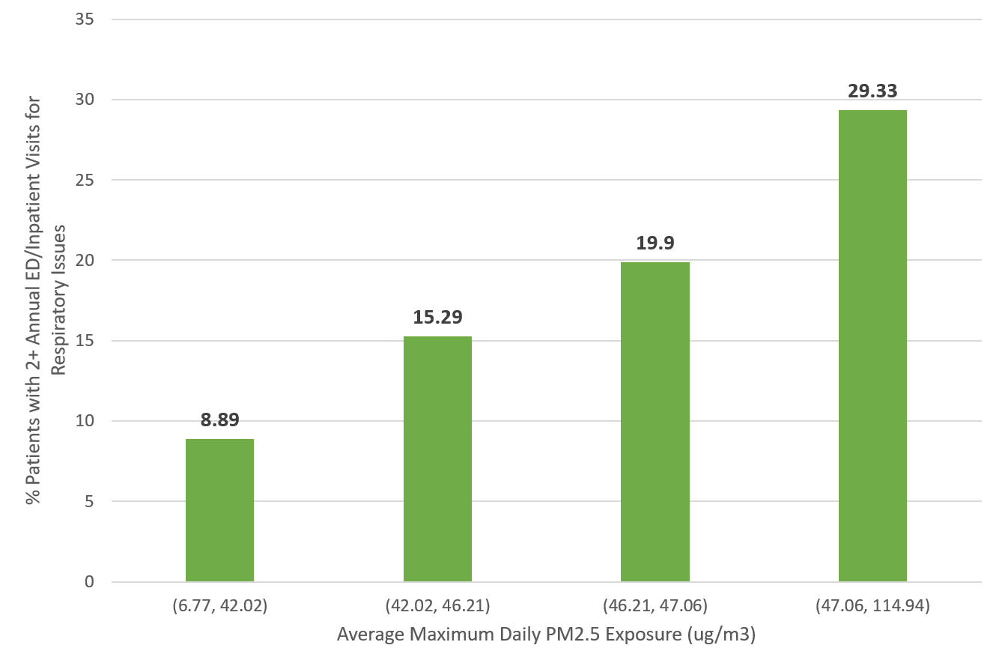

## Innovations in Open Clinical Research

EP, SC, HX, and KF represent scientific and technical members of Green Team who are working together to integrate clinical data with non-clinical data as part of the Translator program. They realize that the Translator program is grounded in open science and the ability to openly access and integrate disparate biomedical datasets, including clinical datasets. Yet, they also recognize and respect the numerous federal regulations, such as HIPAA, that surround the use of human subjects in research and the right to access clinical data. In addition, EP, SC, HX, and KF are aware that institution-specific regulations and guidelines surround access to clinical data and address cultural sensitivities and concerns regarding the reputation and liability of healthcare providers and institutions. Moreover, they recognize that the integration of clinical datasets with non-clinical datasets presents technical challenges. For instance, the integration of clinical data with data on environmental exposures requires a careful consideration of space (i.e., where a patient is exposed) and time (i.e., when a patient is exposed), necessitating access to Protected Health Information (PHI), i.e., geocodes and dates.

In light of these challenges, EP, SC, HX, and KF brainstorm and consider a variety of approaches to overcome the challenges and achieve their goals. While attending a Translator hackathon, they learn that Red Team has developed an approach for openly exposing data from Columbia University Irving Medical Center: Columbia Open Health Data (COHD; Ta et al. 2018). COHD provides open access to observational patient data in the form of co-occurrence counts of pairs of concepts or clinical feature variables (e.g., medications and diagnoses), as well as their relative frequency and observed-expected frequency ratio.

Red Team’s work triggers an interesting thought among Green Team members: what if we can expand upon these efforts, using observational patient data from UNC Health Care and a different approach? Intense brainstorming, and a bit of creative thinking, lead to the development of a novel framework and approach for openly exposing and sharing integrated clinical and environmental data: [ICEES](/apps/icces) (Integrated Clinical and Environmental Exposures Service). 

ICEES has shown promise as a new approach for open access to observational patient data that have been integrated with environmental exposures data at the patient and visit level. For instance, the figure below demonstrates a significant association between exposure to particulate matter of size ≤ 2.5-microns in diameter (PM2.5) and emergency department (ED) or inpatient visits for respiratory issues among patients with ‘asthma-like’ conditions. Specifically, the results show that the proportion of patients with two or more annual ED or inpatient visits for respiratory issues increases with increases in maximum daily exposure to PM2.5 (N = 23,093; P < 0.0001; calendar year 2010).

These results replicate an established relationship between exposure to PM2.5 and asthma exacerbations (e.g., Mirabelli et al. 2016)—a critical landmark in validation of ICEES and demonstration of the service’s utility.

Of note, these results have been published in *JAMIA*, a peer-reviewed journal (Fecho et al. 2019). An overview of clinical data types, including ICEES and COHD, also has been published in a peer-reviewed journal, *Clinical and Translational Science* (Ahalt et al. 2019).

EP, SC, HX, and KF are now working together to further validate ICEES in the context of additional use cases cases and extend ICEES to include data on multiple patient cohorts and a variety of data types, including a variety of environmental exposures.

_**Translator-inspired innovation!**_

**References:**

Ahalt SC, Chute CG, Fecho K, Glusman G, Hadlock J, Solbrig H, Overby-Taylor C, Pfaff E, Ta C, Tatonetti N, Weng C,* and The NCATS Biomedical Data Translator Consortium. Clinical data: sources and types, regulatory constraints, applications. *Clin Transl Sci*, 2019 [E-pub ahead of print] doi: 10.1111/cts.12638. *Authors are listed alphabetically. https://ascpt.onlinelibrary.wiley.com/doi/full/10.1111/cts.12638.

Fecho K, Pfaff E, Xu H, Champion J, Cox S, Stillwell L, Bizon C, Peden D, Krishnamurthy A, Tropsha A, Ahalt SC. A novel approach for exposing and sharing clinical data: the Translator Integrated Clinical and Environmental Exposures Service. *J Am Med Inform Assoc*, 2019 [E-pub ahead of print]. doi: 10.1093/jamia/ocs042. https://academic.oup.com/jamia/advance-article-abstract/doi/10.1093/jamia/ocz042/5480568?redirectedFrom=fulltext.

Mirabelli MC, Vaidyanathan A, Flanders WD, Qin X, Garbe P. Outdoor PM2.5, ambient air temperature, and asthma symptoms in the past 14 days among adults with active asthma. *Environ Health Perspect* 2016;124(12):1882–90.

Ta C, Dumontier M, Hripcsak G, Tatonetti N, Weng C. Columbia Open Health Data, clinical concept prevalence and co-occurrence from electronic health records. *Sci Data* 2018; 5:180273. doi:10.1038/sdata.2018.273.

