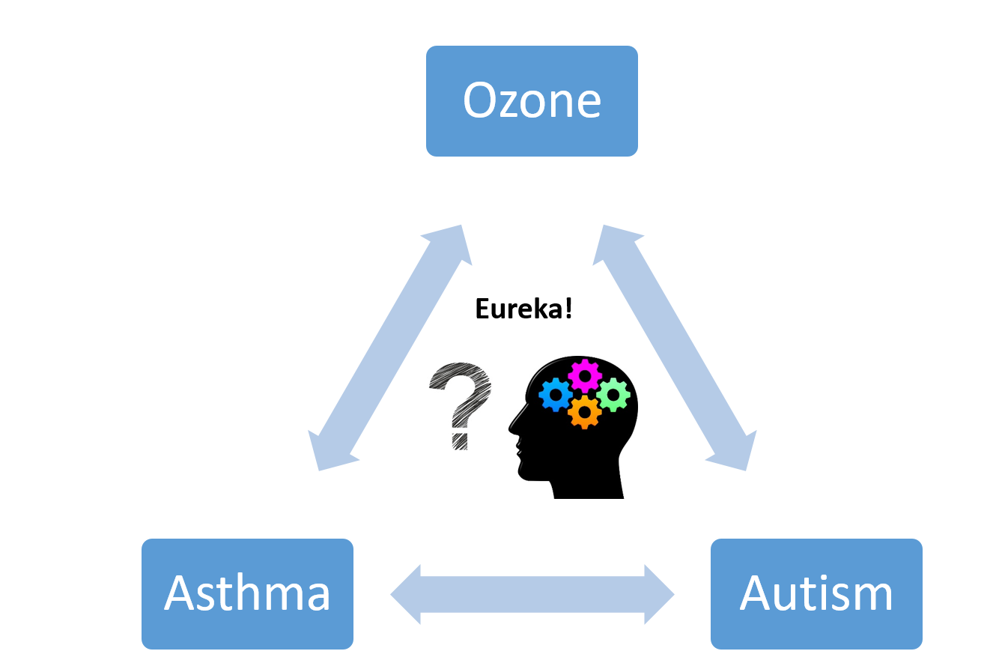

## Translator as an Intuition Driver and Hypothesis Generator

KF is a translational scientist seeking to understand the health consequences of airborne pollutant exposure. As part of this effort, she used [ICEES](/apps/icees) to identify a significant association between exposure to ozone and frequent emergency or inpatient visits for respiratory issues among a defined subset of patients with asthma-like conditions. KF then used [ROBOKOP](/apps/robokop) to explore the mechanistic underpinnings of this relationship. Specifically, she ran an AOP structured as follows:

ozone ⇨ gene ⇨ phenotypic

feature. While exploring the answers, KF noticed something interesting: many of the answers included things like developmental process, nervous system development, abnormal sensory perception of sound, visual perception, abnormal peripheral nerve conduction, etc. This prompted a thought: might ozone be associated with asthma and autism? Sure enough, a subsequent search of PubMed revealed a small, but growing, recent body of work on the relationship between ozone and asthma. Moreover, a subsequent query of [ICEES](/apps/icees) revealed that $0.22\%$ of patients in the cohort of patients with asthma-like conditions had diagnoses of both asthma and ozone versus $0.043\%$ in the general population of patients at UNC Health Care System. The investigators are now using [TranQL](/apps/tranql) to explore a richer set of relationships between chemical exposures in [ICEES](/apps/icees) cohorts and AOPs in [ROBOKOP](/apps/robokop).

> I have a PhD in neurobiology, expertise in inflammatory disorders such as asthma, and a child with autism. And yet, I never would have suspected any sort of relationship between ozone and autism!
>
> — Dr. KF

_**Translator-enabled serendipity!**_

**References**

**Bizon C**, **Cox S**, **Balhoff J**, **Kebede Y**, **Wang P**, **Morton K**, **Fecho K**, **Tropsha A**. ROBOKOP KG AND KGB: Integrated Knowledge Graphs from Federated Sources. *JCIM*, under review.

**Morton K**, **Wang P**, **Bizon C**, **Cox S**, **Balhoff**, **Kebede Y**, **Fecho K**, **Tropsha A**. ROBOKOP: an abstraction layer and user interface for knowledge grpahs to support question answering. *Bioinformatics*, 2019. [doi:10.1093/bioinformatics/btz604](https://doi.org/10.1093/bioinformatics/btz604).
